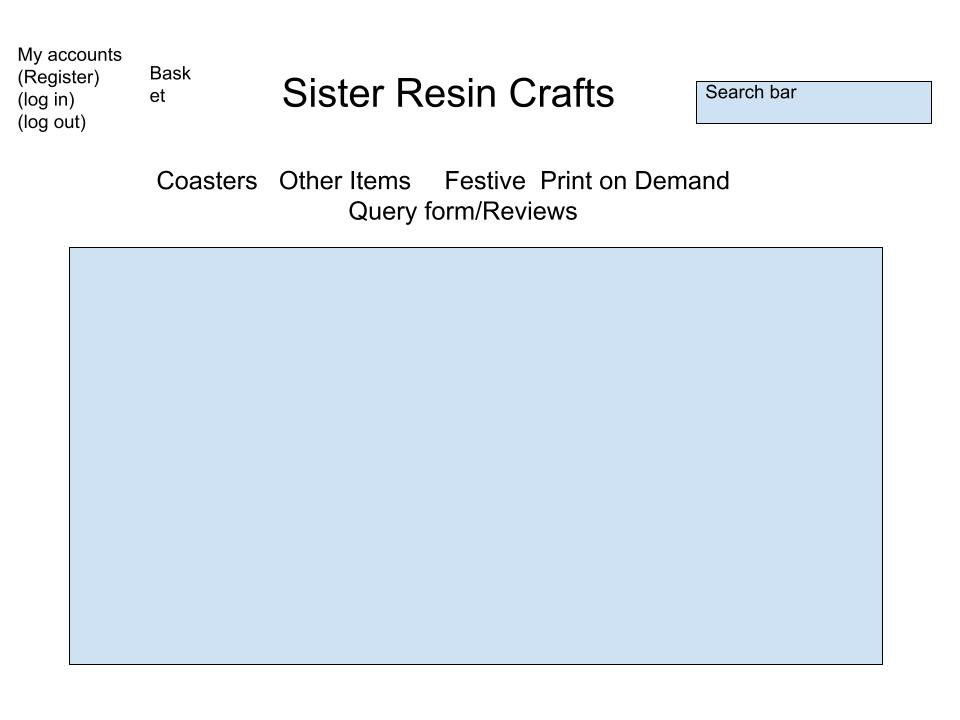
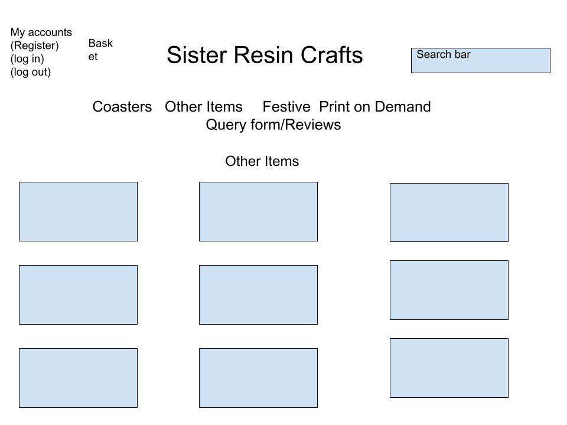
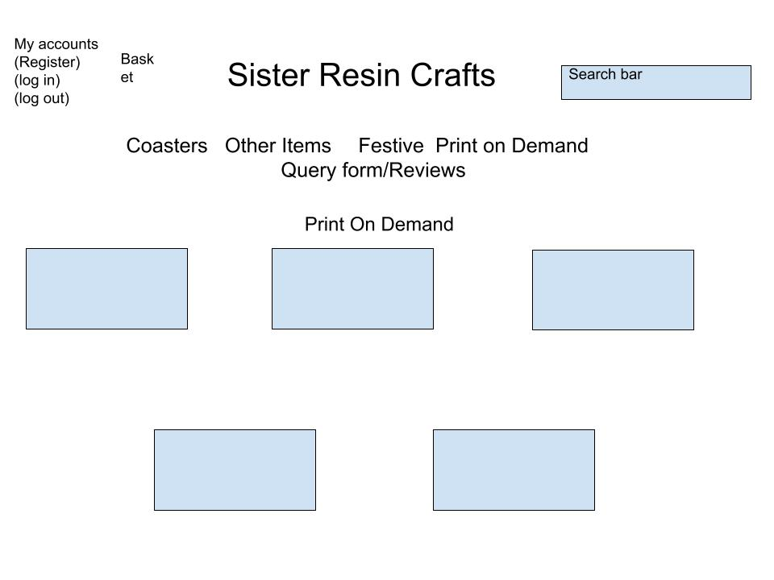
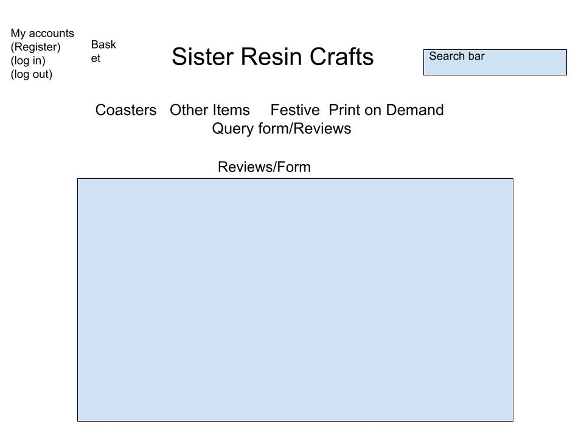

<h1 align="center">Sister Resin Craft</h1>

[View live project]()

This website is the fully functioning website for SisterResin Crafts. Its is designed to be responsive for mobile and tablet and work on all modern browers.
The site has 6 pages consisting of a Home page, Other Items, Seasonal, Print on Demand, Reviews and Querys and a Terms and Conditions page.
There is also a Search bar, a registration page and the abiilty to buy items and to become an account holder. 

<h2 align="center"></h2>

<h2>Screenshots:</h2>

## User Experience

The target audience for this site is for people who like something different from the normal slasher coasters to print ondemand t-shirts.

The goals of the business are:

1.  Increasing traffic from social media
2.  Creating more content
3.  Customer satisfaction
4.  Loyalty among customers
5.  Growing our online presence
6.  To have growth
7.  To have a good reputation for potential customers

As a customer I want to:

1.  To learn the background of the company.
2.  For the site to be user friendly and easy to navigate.
3.  View a list of products
4.  View details of each product
5.  Easy access to special offers
6.  To keep track on my spending
7.  To Register an account and easily log in and out
8.  To know the refund policy and the terms and conditions
9.  Recover my password
10. Reviews and ratings from other customers to be easy to locate
11. To recieve email conformation after registration and after an order
12. Search for an item
13. Not to have annoying pop ups
14. Easy to purchase Items
15. Easy navigation to Social Media links

As a returning customer I want:

1.  To see the website has been updated and what new items are available
2.  To easily find any promotional offers available including sales
3.  To be able to contact company directly with any queries or customer order

## Wireframes

   
  

   
  

## Design

## Typography

## Technologies Used

## Frameworks, Libraries & Programs Used

## Testing

## Testing User Stories from User Experience Section

## Bugs

## Deployment

## Acknowledgements

